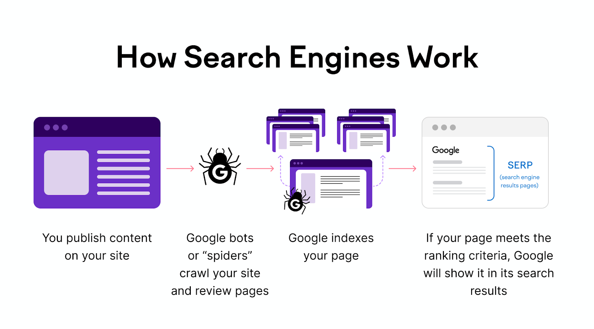

[**_``Go Back``_**](../README.md)

# Module 1: Introduction to SEO

## Definition and importance of SEO

``Search Engine Optimization (SEO)`` refers to the process of enhancing a website to increase its visibility for relevant searches on search engines like ``Google``, ``Bing``, and ``Yahoo``. The better visibility a site has in search results, the more likely it is to attract attention and drive organic (non-paid) traffic to the site.

``SEO`` is important for brands as it’s a highly effective way to improve your brand’s visibility through search, drive more traffic to your website, establish your brand as a trusted authority in your industry, sustainably and reliably grow your business, and much more. Here’s how each of these factors contributes to the importance of ``SEO`` for your brand.

- **Visibility and Rankings**: ``SEO`` helps your brand appear higher in search results, increasing the likelihood that users will click on your site and become familiar with your brand.

- **Web Traffic**: By improving your search engine ranking, ``SEO`` increases the number of visitors to your website, creating more opportunities for sales.

- **Trustworthiness**: Higher search engine rankings enhance your brand's credibility and trust with potential customers, as users trust the recommendations of search engines.

- **User Experience**: A well-optimized site provides clear information and easy navigation, improving both user experience and search engine rankings.

- **Growth**: ``SEO`` drives organic traffic to your site, leading to increased customer acquisition, sales, and brand visibility on social platforms.

## How search engines work (crawling, indexing, ranking)

Search engines operate through a process involving three main stages: ``crawling``, ``indexing``, and ``ranking``. Here’s a concise explanation of each stage:

### Crawling
``Crawling`` is the initial step where search engines use automated bots called ``crawlers`` or ``spiders`` to explore the web. The purpose of crawling is to discover new and updated web pages. Crawlers follow links from known pages to new ones, effectively mapping the web.

**How it works:**

- ``Starting Point``: Crawlers begin from a list of URLs from previous crawls or sitemaps provided by website owners.
- ``Following Links``: They follow links on each page to discover additional pages.
- ``Retrieving Content``: They retrieve the content of each page they visit.

### Indexing

``Indexing`` is the process of storing and organizing the content found during the crawl. The search engine analyzes the content of the pages and stores it in a massive database called the index.

**How it works:**

- ``Parsing Content``: The content is parsed, which includes extracting text, images, and other media.
- ``Storing Information``: Key information, such as keywords, page titles, and metadata, is stored in the index.
- ``Organizing Data``: The data is organized in a way that allows for efficient retrieval during a search query.

### Ranking

``Ranking`` is the process of determining the order of search results based on their relevance to the search query. Search engines use complex algorithms to evaluate and rank indexed pages.

**How it works:**

- ``Query Analysis``: When a user submits a query, the search engine analyzes the query to understand its intent and context.
- ``Retrieving Results``: It retrieves relevant pages from the index.
- ``Ranking Factors``: Pages are ranked based on numerous factors, including:
    - ``Relevance``: How closely the content matches the query.
    - ``Quality of Content``: The credibility and depth of the content.
    - ``User Experience``: Factors like page load speed, mobile-friendliness, and ease of navigation.
    - ``Backlinks``: The number and quality of links pointing to the page.
    - ``Freshness``: How recently the content was updated.

## Types of SEO (on-page, off-page, technical, local)

``Search Engine Optimization (SEO)`` involves various strategies to improve a website's visibility on search engine results pages (SERPs). ``SEO`` can be broadly categorized into different types, each focusing on specific aspects of optimization. Here are the main types:

### On-Page SEO

``On-page SEO`` refers to optimizing individual web pages to rank higher and earn more relevant traffic. This type of SEO focuses on both the content and HTML source code of a page.

- **Content Optimization**:
    - ``Keyword Research``: Identifying relevant keywords and integrating them naturally into content.
    - ``High-Quality Content``: Creating valuable, informative, and engaging content that addresses users' needs.
    - ``Meta Tags``: Optimizing meta titles and descriptions to improve click-through rates.
    - ``Headings``: Using heading tags (``H1``, ``H2``, ``H3``, etc.) to structure content and include keywords.

- **HTML Source Code Optimization**:
    - ``URL Structure``: Creating SEO-friendly URLs that are short and descriptive.
    - ``Internal Linking``: Using internal links to improve navigation and distribute link equity across pages.
    - ``Image Optimization``: Using descriptive file names and alt tags for images.

### Off-Page SEO

``Off-page SEO`` focuses on activities outside the website to improve its visibility and authority. This type of SEO is primarily concerned with building backlinks and enhancing the website's reputation.

- **Link Building**:
    - ``Quality Backlinks``: Acquiring links from reputable and relevant websites.
    - ``Guest Blogging``: Writing articles for other websites with backlinks to your site.
    - ``Social Bookmarking``: Submitting links to social bookmarking sites.

- **Social Media Engagement**:
    - ``Social Signals``: Increasing social shares and interactions to boost visibility and drive traffic.

- **Brand Mentions**:
    - ``Influencer Outreach``: Collaborating with influencers to mention and link to your site.

### Technical SEO

``Technical SEO`` involves optimizing the technical aspects of a website to improve its crawling and indexing by search engines. This ensures that the site meets the technical requirements of search engines.

- **Site Speed**:
    - ``Page Load Time``: Optimizing the speed at which pages load.
    - ``Image Compression``: Reducing image sizes for faster loading.

- **Mobile-Friendliness**:
    - ``Responsive Design``: Ensuring the website is accessible and functional on mobile devices.

- **Site Architecture**:
    - ``Crawlability``: Making sure search engine bots can crawl the site effectively.
    - ``Sitemaps``: Creating XML sitemaps to help search engines find and index pages.
    - ``Robots.txt``: Using ``robots.txt`` files to control which pages search engines should crawl.

- **HTTPS**:
    - Security: Implementing HTTPS to secure the site and improve rankings.

### Local SEO

``Local SEO`` focuses on optimizing a website to attract traffic from local searches. This is especially important for businesses that operate in specific geographic areas.

- **Google My Business (GMB)**:
    - ``GMB Profile``: Creating and optimizing a GMB profile with accurate business information.
    - ``Reviews and Ratings``: Encouraging positive customer reviews and managing ratings.

- **Local Citations**:
    - ``NAP Consistency``: Ensuring that the business name, address, and phone number (NAP) are consistent across all platforms.
    - ``Local Directories``: Submitting business information to local directories and review sites.

- **Localized Content**:
    - ``Local Keywords``: Using keywords related to the local area and community.
    - ``Localized Landing Pages``: Creating landing pages for specific locations or services.